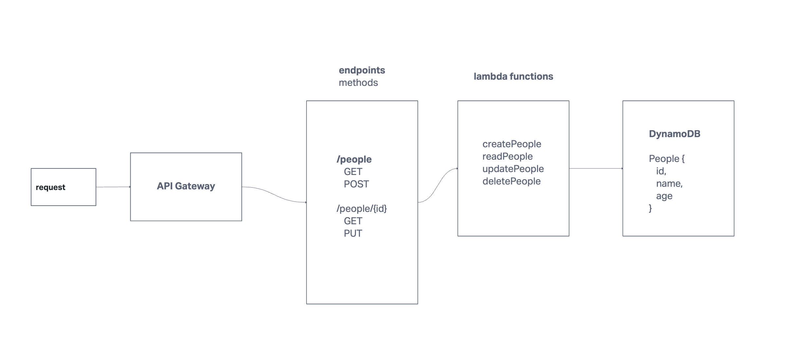

# serverless-api

## UML

## Description

These are lambda functions for a severless REST API on AWS:
* First, we set up an API Gateway on AWS for our routes.
* Our routes are set to the endpoint /people and /people/{id}
* GET, POST, PUT, and DELETE methods are attached to the endpoints.
* These methods trigger our lambda functions.
* Our lambda functions use Dynamoose to interface with DynamoDB.
* With our Dynamoose People model, we perform CRUD operations on our People table in DynamoDB.

## Routes

/people
* GET (gets all People)
  * just requires a GET request to the endpoint.
  * Returns all People in the body.
* POST (creates an entry in People)
  * requires a JSON-formatted body with name and age fields.
  * Returns a copy of the created entry.

/people/id
* PUT (updates an entry in People)
  * requires a JSON-formatted body with the updated name and/or age field.
  * requires the id of the entry we want to update.
  * Returns an integer representing how many entries were updated.
* DELETE (deletes an entry in People)
  * requires the id of the entry we want to delete.
  * Returns an integer representing how many entries were deleted.